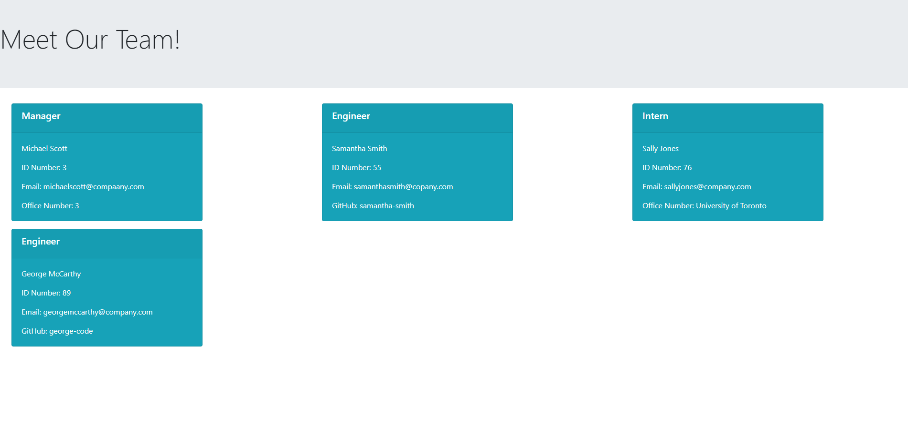

  # Team Profile Generator
  ## Table of Contents
  - [Description](#description)
  - [Installation Instructions](#installation-instructions)
  - [Usage Information](#usage-information)
  - [Testing Instructions](#testing-instructions)
  - [Questions?](#questions)

  ## Description
  This is a command line app that will generate a webpage for a team of coworkers. The content of the webpage is dynamically generated based on the information the user provides.
  ## Installation Instructions
  Node.js and the Inquirer and Jest modules are required. Download the files for the Team Profile Generator from this GitHub repository, and open them in VS Code.
  ## Usage Information
  Open a new terminal, and enter "node index.js" to begin the program. Answer the prompts provided, and a new HTML page featuring your information will be generated.
  ## Testing Instructions
  Open the terminal in VS Code and enter "npm run test" to activate Jest.

  

  Walkthrough Video: https://drive.google.com/file/d/1MvQ8yi5fdPTY5w-2QUaM36NvCueSBvTO/view
  
 A sample HTML document generated with this app is also included in the dist folder of this repository - Michael-team.html.